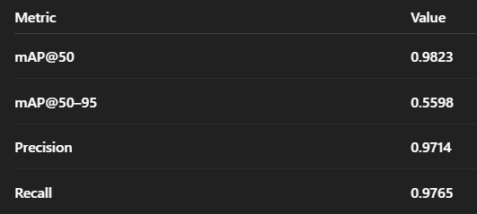
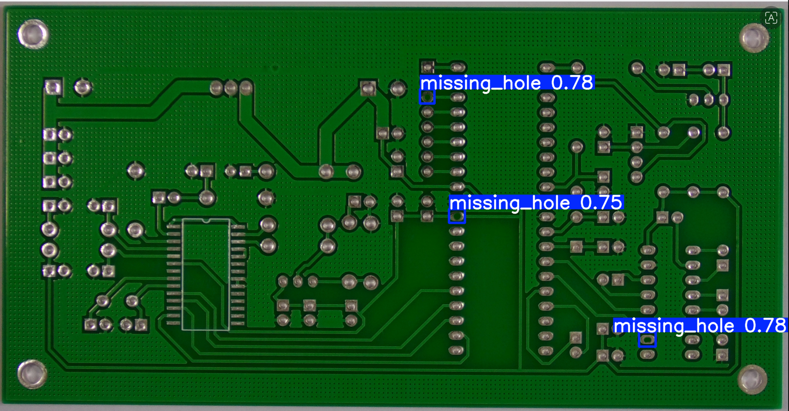
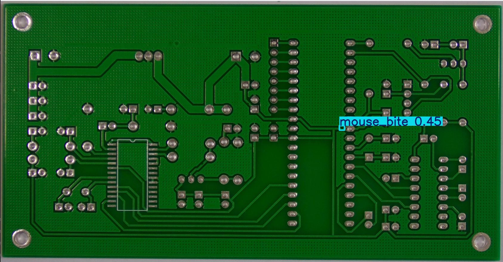
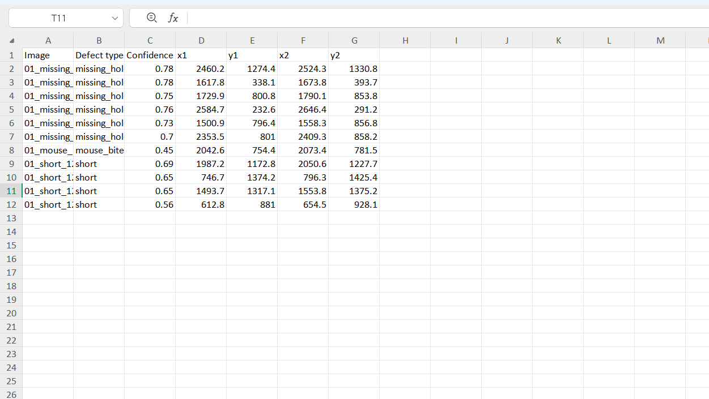
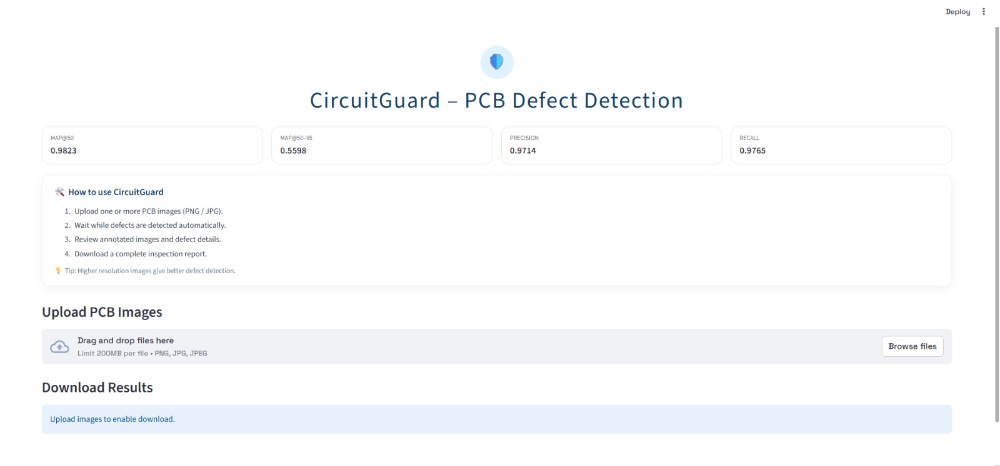
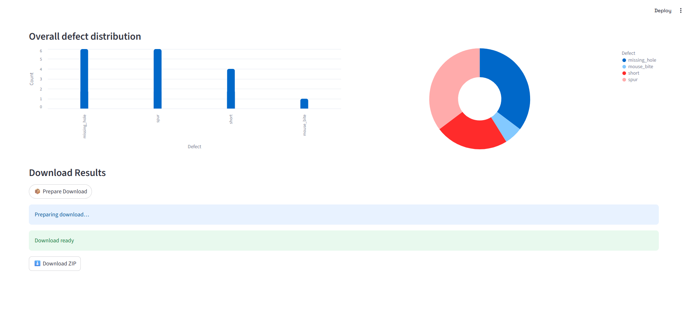
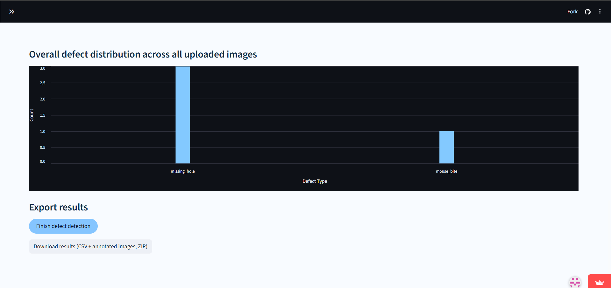

🛡️ CircuitGuard – PCB Defect Detection System
CircuitGuard is an AI-powered PCB defect inspection system built using YOLOv11m, FastAPI, and Streamlit.
It automates PCB defect detection, supports batch inspection, and generates annotated images and structured reports, making it suitable for industrial and academic use.

------

# Features
* Automatic PCB defect detection using YOLOv11m
* Single & batch image inspection
* Precise defect localization with bounding boxes
* Interactive Streamlit dashboard
* Downloadable outputs:
* Annotated images
* CSV defect reports
* Zipped batch results
* FastAPI backend for scalable inference

------

# Tech Stack
* Model: YOLOv11m (Ultralytics)
* Backend: FastAPI
* Frontend: Streamlit
* Language: Python
* Deployment: Local 

------

# Project Structure
CircuitGuard/
├── backend/        # FastAPI inference server
├── frontend/       # Streamlit UI
├── screenshots/    # Output & UI images
├── requirements.txt
└── README.md

------

# Setup & Run
git clone https://github.com/prachi-2506/CircuitGuard.git
cd CircuitGuard

* Backend
cd backend
pip install -r requirements.txt
uvicorn main:app --reload

* Frontend
cd frontend
pip install -r requirements.txt
streamlit run app.py

------

# Model Performance
* Trained on a custom PCB defect dataset (80:20 split)
* High precision & recall for reliable inspection
* Optimized for small and subtle PCB defects

------

#Sample outputs:
 * Annotated images

 * CSV file having exact defect location:

---

#Screenshots of the website

------

# Future Scope
Cloud / edge deployment
Factory inspection pipeline integration
Real-time camera-based PCB inspection

------

# Acknowledgements
Ultralytics YOLO
Streamlit
FastAPI

------

⭐ If you find this project useful, consider starring the repository!

