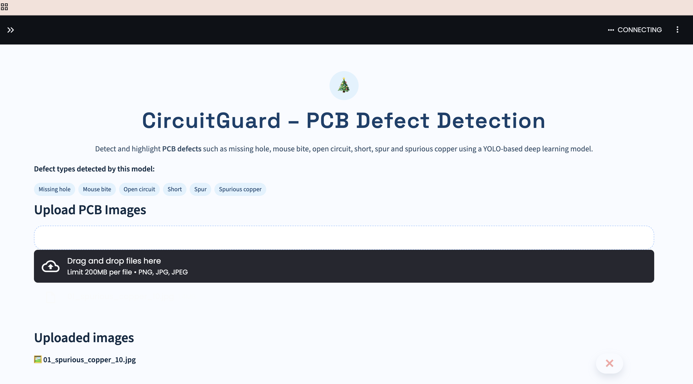

<h1 align="center"> ♨︎ CircuitGuide ♨︎ </h1>
<h3 align="center">AI-Based PCB Defect Detection System</h3>

  <b>Detect • Analyze • Improve PCB Quality using AI</b>

  
  
  
  

---

## 🧠 About CircuitGuide

CircuitGuide is an **AI-powered PCB defect detection system** that automatically identifies defects in Printed Circuit Boards using **Deep Learning and Computer Vision**.

The goal of this project is to reduce manual inspection effort and improve accuracy in industrial PCB quality control.

---

## 🎯 Problem Statement

Manual PCB inspection:
- ⏱️ Takes a lot of time  
- ❌ Is prone to human error  
- 💸 Increases manufacturing cost  

CircuitGuide solves this problem by using an AI model to detect defects automatically from PCB images.

---

## 🚀 Features

- 🔍 Automatic detection of PCB defects  
- 🧠 YOLO-based deep learning model  
- ⚡ FastAPI backend for inference  
- 📸 Image upload and annotated output  
- 📊 Defect count summary  
- 📍 Defect location table  
- ⬇️ Download annotated images and reports  

---

## 🛠️ Tech Stack

**Programming Language**  
- Python  

**AI / Machine Learning**  
- YOLOv8  
- OpenCV  
- NumPy  
- Pandas  

**Backend**  
- FastAPI  
- Uvicorn  

---

## 🧩 System Architecture
PCB Image Upload
     ↓
FastAPI Backend
     ↓
YOLO Defect Detection Model
     ↓
Annotated Image + Defect Data
     ↓
Download Results

---

## 📸 Screenshots

### 🔹 Input PCB Image

### 🔹 Defect Detection Output

---

## ⚙️ How to Run the Project

Clone the repository  
`git clone https://github.com/prashantyadav12/CircuitGuide-PCB_Defect_Detection.git`

Move into project folder  
`cd CircuitGuide-PCB_Defect_Detection`

Create virtual environment  
`python -m venv venv`

Activate virtual environment (Windows)  
`venv\Scripts\activate`

Activate virtual environment (Mac/Linux)  
`source venv/bin/activate`

Install dependencies  
`pip install -r requirements.txt`

Run FastAPI server  
`uvicorn main:app --reload`

Open Swagger Docs  
`http://127.0.0.1:8000/docs`

---

## 🌐 API Endpoints

- `GET /` → Health check  
- `POST /detect` → Upload PCB image for defect detection  

---

## 📊 Project Outcome

- ✔ Accurate multi-defect detection  
- ✔ Fast inference speed  
- ✔ Clear visual results  
- ✔ Industry-oriented workflow  

---

## 🔮 Future Enhancements

- Web frontend dashboard  
- Cloud deployment  
- Live camera inspection  
- Defect severity analysis  
- Analytics and reporting  

---

## 👨‍💻 Author

**Prashant Yadav**  
Computer Science (AI) Student  
AI • Backend • System Integration  

🔗 LinkedIn:  
https://www.linkedin.com/in/prashant-yadav-638684298/

---

  

